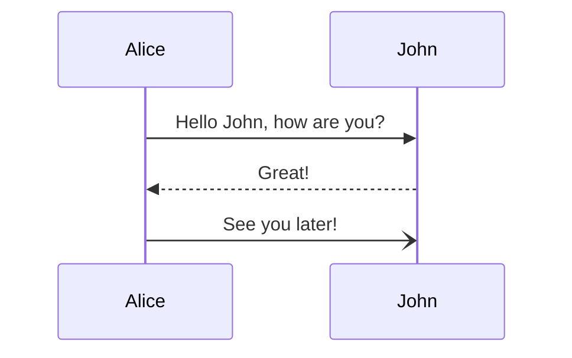
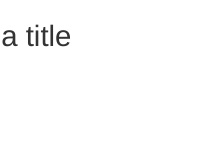

# @nexeth/mermaid

`@nexeth/mermaid` is a tool for generating mermaid diagrams via code. This is useful for creating automated tools that generate mermaid diagram for you.

## ⬇️ Installation

```bash
bun install @nexeth/mermaid
```

or

```bash
yarn install @nexeth/mermaid
```

or

```bash
npm install @nexeth/mermaid
```

## Usage

## _Sequence Diagram_

> A Sequence diagram is an interaction diagram that shows how processes operate with one another and in what order. Consult the [official documentation](https://mermaid.js.org/syntax/sequenceDiagram.html) for more information

### @nexeth/mermaid Syntax

```ts
const diagram = new SequenceDiagram();
diagram.message("Alice", "->>", "John", "Hello John, how are you?");
diagram.message("John", "-->>", "Alice", "Great!");
diagram.message("Alice", "-)", "John", "See you later!");

const render = diagram.render();
console.log(render);
```

### Mermaid Syntax

```
sequenceDiagram
    Alice->>John: Hello John, how are you?
    John-->>Alice: Great!
    Alice-)John: See you later!
```

### Generated Diagram



### Setup

Create a new Sequence Diagram

```ts
import { SequenceDiagram } from "@nexeth/mermaid";

const diagram = new SequenceDiagram();
```

### Reset

Each action in a sequence diagram is stored in the order it was added. This means it is not possible to remove an item once it has been added. If you wish to start again with the same diagram instance, calling `reset` will reset the diagram

```ts
const diagram = new SequenceDiagram("Test");
// ...
diagram.reset();
```

### Render

To return the rendered diagram, call the `render` function. Note that this only returns the correctly formatted sequence diagram and does not generate the diagram itself.

```ts
const diagram = new SequenceDiagram();
const output = diagram.render();
```

### Title

A title is optional for a sequence diagram

```ts
const diagram = new SequenceDiagram("This is a title");
```

This will render



### Participants

The participants can be defined implicitly as in the first example on this page. The participants or actors are rendered in order of appearance in the diagram source text. Sometimes you might want to show the participants in a different order than how they appear in the first message. It is possible to specify the actor's order of appearance
