# @nexeth/mermaid

`@nexeth/mermaid` is a tool for generating mermaid diagrams via code. This is useful for creating automated tools that generate mermaid diagram for you.

## ⬇️ Installation

```bash
bun install @nexeth/mermaid
```

or

```bash
yarn install @nexeth/mermaid
```

or

```bash
npm install @nexeth/mermaid
```

## Usage

## _Sequence Diagram_

> A Sequence diagram is an interaction diagram that shows how processes operate with one another and in what order. Consult the [official documentation](https://mermaid.js.org/syntax/sequenceDiagram.html) for more information

### @nexeth/mermaid Syntax

```ts
const diagram = new SequenceDiagram();
diagram.message("Alice", "->>", "John", "Hello John, how are you?");
diagram.message("John", "-->>", "Alice", "Great!");
diagram.message("Alice", "-)", "John", "See you later!");

const render = diagram.render();
console.log(render);
```

### Mermaid Syntax

```
sequenceDiagram
    Alice->>John: Hello John, how are you?
    John-->>Alice: Great!
    Alice-)John: See you later!
```

### Generated Diagram

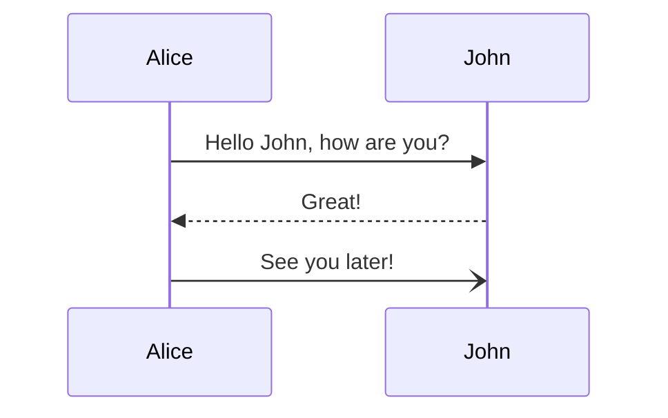

### Setup

Create a new Sequence Diagram

```ts
import { SequenceDiagram } from "@nexeth/mermaid";

const diagram = new SequenceDiagram();
```

### Reset

Each action in a sequence diagram is stored in the order it was added. This means it is not possible to remove an item once it has been added. If you wish to start again with the same diagram instance, calling `reset` will reset the diagram

```ts
const diagram = new SequenceDiagram("Test");
// ...
diagram.reset();
```

### Render

To return the rendered diagram, call the `render` function. Note that this only returns the correctly formatted sequence diagram and does not generate the diagram itself.

```ts
const diagram = new SequenceDiagram();
const output = diagram.render();
```

### Title

A title is optional for a sequence diagram. It can be passed into the constructor for a new diagram

```ts
const diagram = new SequenceDiagram({ title: "This is a title" });
```

This will render

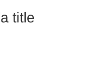

### Participants

The participants or actors in a sequence diagram represent entities that interact with each other. You can define participants in your diagram using the `participant` method.

#### Adding Participants

To add participants to your diagram, use the `participant` method. Participants are added in the order they appear in your code. You can also specify additional options like `type`, `alias`, and `create` for each participant.

```ts
const diagram = new SequenceDiagram();

// Adding participants
diagram
  .participant("Alice")
  .participant("Bob", { type: "actor" }) // Specify type as "actor"
  .participant("Charlie", { alias: "C" }) // Add an alias
  .participant("David", { create: true }); // Create participant

const output = diagram.render();
```

This will render participants in the diagram following the order they were added, along with their specified options:

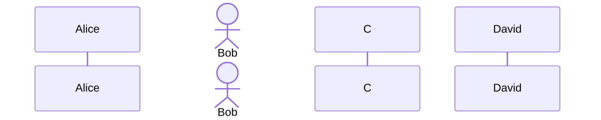

#### Destroying Participants

You can also mark participants for destruction in the diagram. To do this, use the destroyParticipant method. Destroyed participants will be indicated with the destroy keyword in the diagram.

```ts
const diagram = new SequenceDiagram();

// Adding participants
diagram.participant("Alice");
diagram.destroyParticipant("Bob"); // Mark participant for destruction
diagram.participant("Charlie");

const output = diagram.render();
```

This will render participants with the "destroyed" status in the diagram:

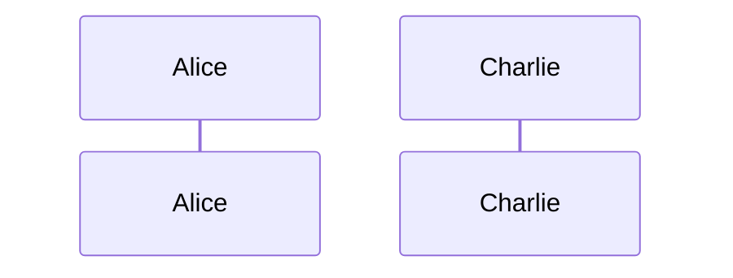

#### Method Chaining

@nexeth/mermaid supports method chaining, making it easier to create your sequence diagrams more compactly. You can chain multiple method calls together to define your diagram. For example:

```ts
const diagram = new SequenceDiagram();

diagram
  .participant("Alice")
  .participant("Bob")
  .message("Alice", "->", "Bob", "Hello")
  .participant("Charlie")
  .message("Charlie", "-->", "Alice", "Hi");

const output = diagram.render();
```

This method chaining allows you to fluently define your sequence diagrams in a more concise manner.

### Messages

Messages in a sequence diagram represent interactions or communication between participants. You can add messages using the `message` method. Messages can have various arrow types and optional activation and deactivation.

#### Adding Messages

To add messages to your diagram, use the `message` method. You can specify the sender, receiver, arrow type, and message text. Additionally, you can include activation and deactivation options for messages.

```ts
const diagram = new SequenceDiagram();

diagram
  .participant("Alice")
  .participant("Bob")
  .message("Alice", "->", "Bob", "Hello")
  .message("Bob", "-->", "Alice", "Hi", { activate: true })
  .message("Alice", "-x", "Bob", "Bye", { deactivate: true });

const output = diagram.render();
```

This will render messages in the diagram with the specified arrows, activation, and deactivation:

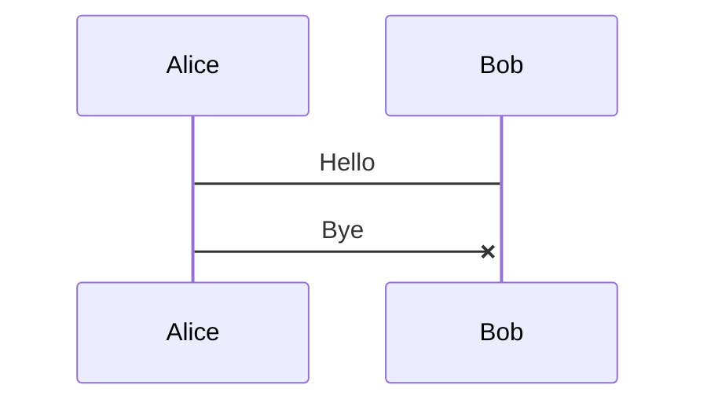

### Boxes

Boxes allow you to group actors or participants within a vertical box in your diagram. You can create boxes using the box method.

#### Adding Boxes

To add a box to your diagram, use the box method. You can specify the text content of the box and, optionally, a background color.

```ts
const diagram = new SequenceDiagram();

diagram
  .participant("Alice")
  .participant("Bob")
  .box("Group A")
  .participant("Charlie")
  .participant("David")
  .end()
  .box("Group B", { color: "lightgray" })
  .participant("Eve")
  .end()

const output = diagram.render();
```

This will render boxes in the diagram, visually grouping participants and actors:

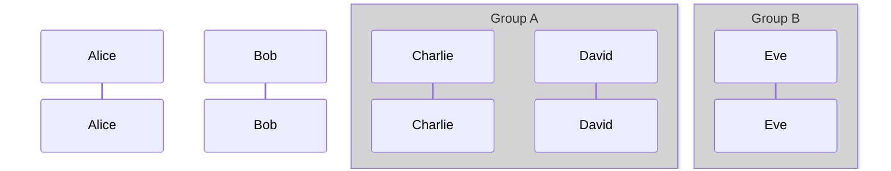

### Activations and Deactivations

You can specify activation and deactivation of participants using the activate and deactivate methods.

#### Activating Participants

To activate a participant, use the activate method and specify the participant's name. This will visually indicate the participant's activation.

```ts
const diagram = new SequenceDiagram();

diagram
  .participant("Alice")
  .participant("Bob")
  .activate("Alice")
  .message("Alice", "->", "Bob", "Hello")
  .message("Bob", "-->", "Alice", "Hi")
  .deactivate("Alice");

const output = diagram.render();
```

This will render activations and deactivations in the diagram:

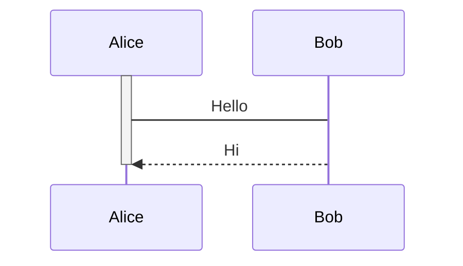

### Notes

Notes are annotations that provide additional information about specific interactions in the diagram. You can add notes using the note methods, such as note, noteOver, noteLeftOf, and noteRightOf.

#### Adding Notes

To add notes to your diagram, use the appropriate note method along with the location, participants, and note text.

```ts
const diagram = new SequenceDiagram();

diagram
  .participant("Alice")
  .participant("Bob")
  .message("Alice", "->", "Bob", "Hello")
  .noteOver(["Alice", "Bob"], "Important note here")
  .message("Bob", "-->", "Alice", "Hi");

const output = diagram.render();
```

This will render notes in the diagram, positioned according to the specified location:

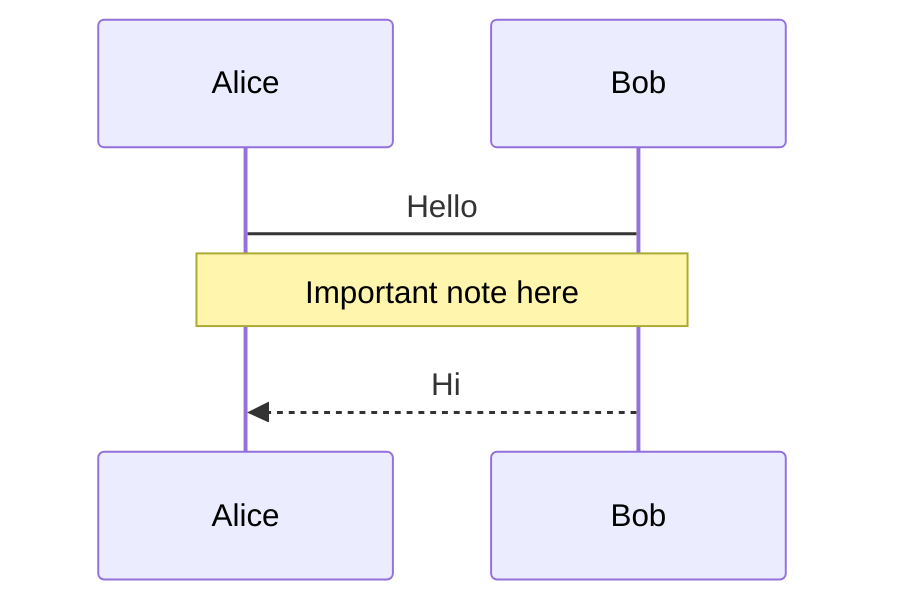

### Regions

Regions in a sequence diagram allow you to define loops, alternatives, and other specialized groupings. You can create regions using methods like loop, alt, else, opt, par, critical, and, and break.

#### Adding Regions

To add regions to your diagram, use the corresponding region method and specify the text content for the region.

```ts
const diagram = new SequenceDiagram();

diagram
  .participant("Alice")
  .participant("Bob")
  .loop("Repeat three times")
  .message("Alice", "->", "Bob", "Hello")
  .message("Bob", "-->", "Alice", "Hi")
  .end()
  .alt("Choice A")
  .message("Alice", "-x", "Bob", "Bye")
  .else("Choice B")
  .message("Alice", "-->", "Bob", "Later")
  .opt("Optional")
  .message("Alice", "->>", "Bob", "Maybe")
  .par("Parallel")
  .message("Alice", "-->>", "Bob", "Hello")
  .critical("Critical")
  .message("Alice", "-->", "Bob", "Important")
  .and("And")
  .message("Alice", "->>", "Bob", "Hello")
  .break("Break")
  .message("Alice", "-->>", "Bob", "Goodbye");

const output = diagram.render();
```

This will render regions in the diagram, visually grouping interactions:

```mermaid
sequenceDiagram
    participant Alice
    participant Bob
    loop Repeat three times
        Alice->Bob: Hello
        Bob-->>Alice: Hi
    end
    alt Choice A
        Alice-xBob: Bye
    else Choice B
        Alice-->Bob: Later
    opt Optional
        Alice->>Bob: Maybe
    par Parallel
        Alice-->>Bob: Hello
    critical Critical
        Alice-->Bob: Important
    and And
        Alice->>Bob: Hello
    break Break
        Alice-->>Bob: Goodbye
```

### Rectangles

Rectangles in a sequence diagram represent a rectangular shape with a specified color. You can add rectangles using the rect method.

#### Adding Rectangles

To add rectangles to your diagram, use the rect method and specify the color of the rectangle.

```ts
const diagram = new SequenceDiagram();

diagram.participant("Alice").rect("lightblue").participant("Bob").end();

const output = diagram.render();
```

This will render rectangles in the diagram with the specified color:

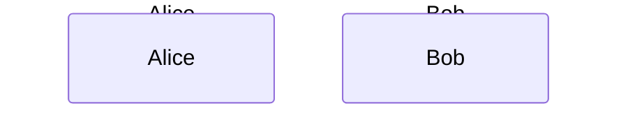

### Comments

Comments in a sequence diagram provide additional information or annotations. You can add comments using the comment method.

#### Adding Comments

To add comments to your diagram, use the comment method and specify the comment text.

```ts
const diagram = new SequenceDiagram();

diagram
  .participant("Alice")
  .message("Alice", "->", "Bob", "Hello")
  .comment("This is a comment")
  .message("Bob", "-->", "Alice", "Hi");

const output = diagram.render();
```

This will render comments in the diagram:

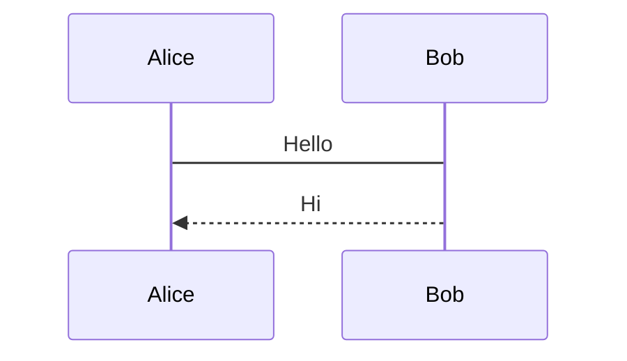

### Custom Elements

Custom elements allow you to include arbitrary text or custom Mermaid syntax in your diagram. You can add custom elements using the custom method.

#### Adding Custom Elements

To add custom elements to your diagram, use the custom method and specify the custom text.

```ts
const diagram = new SequenceDiagram();

diagram.participant("Alice").custom("%% This is a custom element").message("Alice", "->", "Bob", "Hello");

const output = diagram.render();
```

This will render custom elements in the diagram:

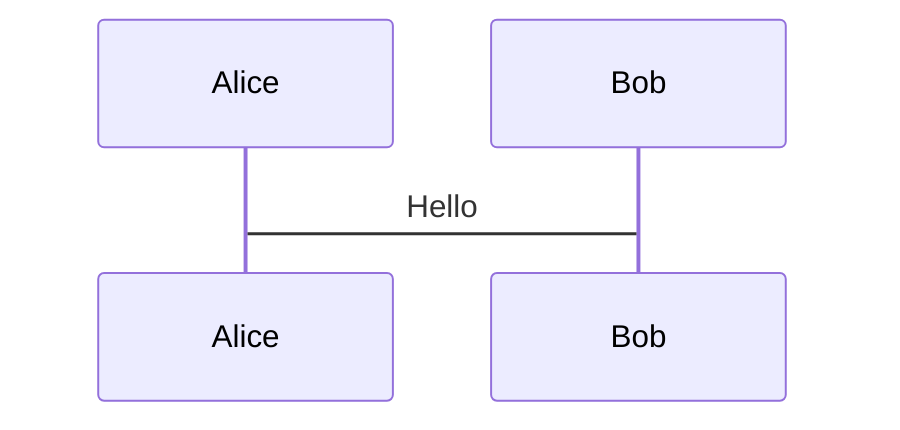

### Rendering

To obtain the final rendered sequence diagram, call the render method on your diagram instance. This will return the correctly formatted sequence diagram as a string.

```ts
const diagram = new SequenceDiagram();

// Add elements to the diagram...

const renderedDiagram = diagram.render();
console.log(renderedDiagram);
```

This will log the generated sequence diagram text to the console.

## Additional Resources

- [Mermaid Official Documentation](https://mermaid.js.org/)

* [Mermaid Live Editor](https://mermaid-js.github.io/mermaid-live-editor/edit#pako:eNpVjstqw0AMRX9FaNVC_ANeFBq7zSbQQrPzZCFsOTMk80CWCcH2v3ccb1qtxD3nCk3Yxo6xxP4W760lUTjVJkCe96ay4gb1NJyhKN7mAyv4GPgxw_7lEGGwMSUXLq-bv18lqKbjqjGodeG6bKh69r8Cz1A3R0oa0_kvOd3jDB-N-7b5_H9ihXPrs-mp7KloSaAieSq4Q8_iyXX5_WlNDKplzwbLvHYkV4MmLNmjUePPI7RYqoy8wzF1pFw7ugj5LVx-AfLqVWg)

That's it! You should now be able to create complex sequence diagrams programmatically using @nexeth/mermaid. Explore the official Mermaid documentation for more advanced features and customization options.
